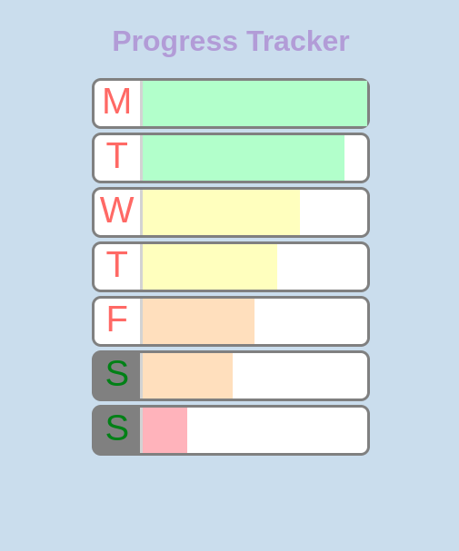

# Progress Tracker

This project is a part of [Scrimba Course - Learn Styled Components in React](https://scrimba.com/learn/styledcomponents).

I have done this react mini project to learn and practice Styled Components in react.

## Learnings :

- ### What are style components and why use them.
- ### Styling through props
- ### Extending Styles
- ### Polymorphic prop
- ### Conditional statement in styling
- ### Nesting
- ### Animation in styled components

 

## Project Snapshot :

 

